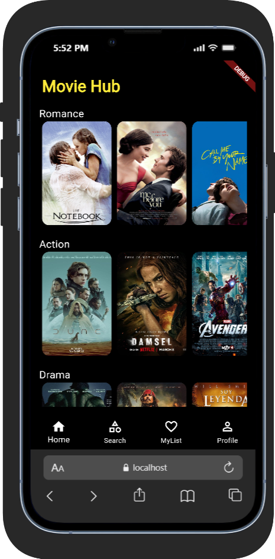

Flutter Movie App Demo — BottomNavigationBar Widget

This Flutter demo app showcases the **BottomNavigationBar** widget through a simple, elegant **Movie App UI**.  
It allows easy navigation between multiple static pages: **Home**, **Categories**, **Search**, **My List**, and **Profile** — each beautifully designed to highlight layout, scrolling, and UI styling concepts in Flutter.

---

## 🚀 How to Run

1. **Clone the repository**
   ```bash
   git clone git@github.com:Sharif2138/Flutter-movie-app-widget-demo.git
Navigate to the project

bash
Copy code
cd movie_app
Get dependencies

bash
Copy code
flutter pub get
Run the app

bash
Copy code
flutter run

Widget Overview
The BottomNavigationBar widget enables users to switch between multiple sections of an app efficiently using icons placed at the bottom of the screen.
It enhances accessibility and maintains consistent navigation across pages.

Key Attributes Explained
Attribute	Description
items: Defines the navigation items — each with an icon and label.
currentIndex:	Keeps track of which tab is currently active.
onTap:	Updates the index when a user taps an icon to switch screens.

Other useful properties:

selectedItemColor → Color of the active icon

unselectedItemColor → Color of inactive icons

type → Controls animation style (fixed or shifting)

backgroundColor → Sets bar color

UI Features

Home: Categories: Multiple horizontally scrollable lists by genre.

Search: A search bar for typing movie names.

My List: Vertically scrollable favorite movies with name, rating, and description.

Profile: User information and settings layout.

All screens use static data (no APIs) for clean demonstration of Flutter layout and widget structuring.

**Screenshot**


**Notes**
Focuses purely on UI and widget logic.

Demonstrates use of ListView, Column, Container, and Decoration styling.

Uses clear navigation logic via setState and currentIndex.

Designed with simple color palette and responsive layout.
